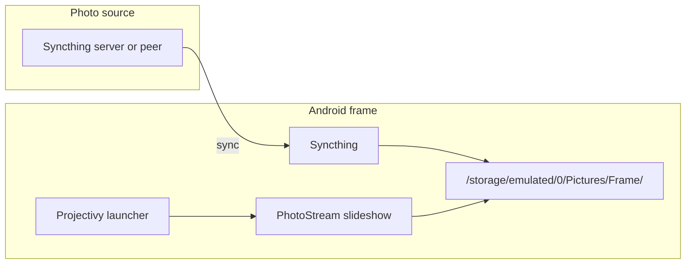

# Frame

Tools and automation for a repurposed Android/Frameo digital photo frame.

The current slideshow app is **PhotoStream**, a small Android 6+ app in this repo. It displays photos from the frame's shared picture folder and is intended to be fed by **Syncthing**.

## Overview

| Piece | Role |
|-------|------|
| **PhotoStream** | Custom Android slideshow app (`com.earendilworks.photostream`) |
| **Syncthing** | Pulls photos from a Syncthing peer/server onto the frame |
| **Projectivy** | Optional Android TV / kiosk-style launcher |



## PhotoStream app

Source lives in:

```text
photostream/
```

PhotoStream reads photos recursively from:

```text
/storage/emulated/0/Pictures/Frame/
```

Features:

- Android 6+ compatible (`minSdk 23`)
- fullscreen immersive slideshow
- keeps the screen awake
- shuffled photos with crossfade transitions
- rotates with device orientation
- bottom-right current time
- top-left photo date from EXIF `DateTimeOriginal`, shown as `📸 {date}`
- if no original EXIF date exists, no photo-date label is shown

Supported file extensions: `jpg`, `jpeg`, `png`, `webp`, `bmp`, `gif`.

### Build/install/run PhotoStream

Requires an Android SDK. If needed:

```bash
export ANDROID_HOME=$HOME/Android/Sdk
export PATH=$ANDROID_HOME/cmdline-tools/latest/bin:$ANDROID_HOME/platform-tools:$PATH
```

Then from the repo root:

```bash
task build-photostream
task install-photostream
task run-photostream
```

The APK is built at:

```text
photostream/app/build/outputs/apk/debug/app-debug.apk
```

## One-time frame setup

You need a USB or network ADB connection to the frame:

```bash
task devices
```

### 1. Optional: install Projectivy

```bash
task install-projectivy
```

Requires `projectivy.apk` in the repo root. This file is not committed.

After installing, choose Projectivy as the home app on the device and configure it to launch PhotoStream if desired.

### 2. Install Syncthing

```bash
task install-syncthing
task run-syncthing
```

Requires `Syncthing_1.23.0_APKPure.apk` in the repo root. This file is not committed.

On the frame, open Syncthing and:

1. Pair with the Syncthing peer/server that holds the photo library.
2. Add a folder that syncs into `/storage/emulated/0/Pictures/Frame/`.
3. Let the initial sync finish.

### 3. Install PhotoStream

```bash
task install-photostream
task run-photostream
```

Grant storage permission on first launch so the app can read the photo folder.

## Photo sync

Normal operation is via Syncthing into:

```text
/storage/emulated/0/Pictures/Frame/
```

For a one-off copy/debug session, put photos in local `./photos/` and run:

```bash
task sync
```

This pushes `./photos/*` to the frame picture folder via ADB.

## Task reference

Requires [Task](https://taskfile.dev) (`task` on your PATH).

| Task | Description |
|------|-------------|
| `devices` | List ADB devices |
| `version` | Print Android build/device properties |
| `list-installed-packages` | List installed Android packages |
| `list-filesystem` | List a filesystem path on the device; optional `PATH=/some/path` |
| `install-projectivy` | Install Projectivy APK and open the Android Home picker |
| `install-syncthing` | Install Syncthing APK |
| `run-syncthing` | Launch Syncthing |
| `build-photostream` | Build the custom PhotoStream debug APK |
| `install-photostream` | Build and install PhotoStream |
| `run-photostream` | Launch PhotoStream |
| `sync` | Push local `./photos/*` to `/storage/emulated/0/Pictures/Frame/` |
| `android-back` | Send Android Back key |
| `restart-frame` | Reboot device and launch the legacy Fotoo package |

Example filesystem listing:

```bash
task list-filesystem PATH=/storage/emulated/0/Pictures/Frame
```

## Repository layout

```text
.
├── Taskfile.yml                         # ADB/build helpers
├── photostream/                         # custom Android slideshow app
├── projectivy.apk                       # launcher APK, local only/gitignored
├── Syncthing_1.23.0_APKPure.apk         # Syncthing APK, local only/gitignored
└── photos/                              # optional local photos for `task sync`, gitignored
```

APKs, SDK files, generated build output, and photo content should stay local and out of git.

## Prerequisites

- Android/Frameo-compatible device with developer options and USB debugging or network ADB enabled
- `adb` on the host
- [Task](https://taskfile.dev)
- Android SDK for building PhotoStream
- Syncthing peer/server containing the photo library

## Privacy / sensitive data

The repo should not contain real photos, secrets, tokens, or Wi-Fi credentials. Local APKs and `photos/` are intended to remain uncommitted.
