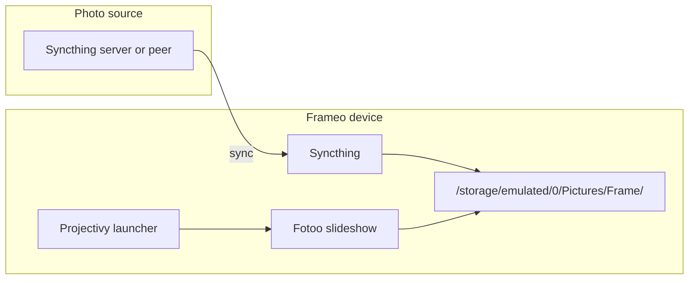

# Frame

Tools and automation for a **Frameo** digital photo frame, repurposed to run **Projectivy** (launcher), **Fotoo** (slideshow), and **Syncthing** (photo sync) instead of the stock Frameo app.

## Overview

| Piece | Role |
|-------|------|
| **Projectivy** | Android TV / kiosk-style launcher; replaces the stock home screen |
| **Fotoo** | Photo frame slideshow app (`com.bo.fotoo`) |
| **Syncthing** | Pulls photos from your Syncthing server or another device onto the frame |

Setup order matters: install the launcher first, then the slideshow app, then configure Syncthing so photos land where Fotoo expects them.



## One-time frame setup

You need a USB or network ADB connection to the frame (`adb devices` should list it).

### 1. Install Projectivy and set it as Home

```bash
task install-projectivy
```

Requires `projectivy.apk` in the repo root (not committed).

The task opens the Android Home picker. Choose **Projectivy** and complete any on-device launcher settings so the frame boots into Projectivy instead of the stock UI.

### 2. Install Fotoo

```bash
task install-fotoo
```

Requires `fotoo_xapk/` with the extracted XAPK contents (not committed; see [Repository layout](#repository-layout)).

Point Fotoo at your photo folder (see [Photo sync](#photo-sync)). Launch Fotoo from Projectivy as the slideshow app.

### 3. Install and configure Syncthing

```bash
task install-syncthing
```

Requires `Syncthing_1.23.0_APKPure.apk` in the repo root (not committed).

On the frame, open Syncthing and:

1. Pair with your Syncthing server or another device that holds the photo library.
2. Add a folder that syncs **into** the path Fotoo uses (default below).
3. Let the initial sync finish before expecting new photos in the slideshow.

### Verify

```bash
task list-installed-packages
task version
```

After setup, the frame boots into Projectivy, Fotoo shows the slideshow, and Syncthing keeps the picture folder up to date.

## Photo sync

Fotoo reads photos from:

```text
/storage/emulated/0/Pictures/Frame/
```

Configure the Syncthing folder on the frame to use this path (or change Fotoo’s folder to match wherever Syncthing writes).

Photos flow from your Syncthing peer or server to the device over the network. No host-side `adb push` or cron job is required for day-to-day updates.

### Optional: manual push via ADB

For one-off copies or debugging without Syncthing, with `photos/` on your machine and ADB connected:

```bash
task sync
```

This runs `adb push` from `./photos/*` into the frame path above.

## Task reference

Requires [Task](https://taskfile.dev) (`task` on your PATH).

| Task | Description |
|------|-------------|
| `devices` | List ADB devices |
| `version` | Print Android build / device properties |
| `list-installed-packages` | `pm list packages` on the frame |
| `install-projectivy` | Install Projectivy and open the Home picker |
| `install-fotoo` | Install Fotoo split APKs from `fotoo_xapk/` |
| `install-syncthing` | Install Syncthing APK on the frame |
| `sync` | Push `./photos/*` to the frame Pictures folder (optional) |
| `restart-frame` | Reboot and launch Fotoo |
| `android-back` | Send Android Back key |

## Repository layout

```text
.
├── Taskfile.yml                      # adb helpers
├── fotoo_xapk/                       # extracted Fotoo XAPK (gitignored)
├── projectivy.apk                    # launcher APK (gitignored)
├── Syncthing_1.23.0_APKPure.apk      # Syncthing APK (gitignored)
└── photos/                           # optional local photos for `task sync` (gitignored)
```

APKs and photo content stay local; the repo holds Task automation only.

## Prerequisites

- Frameo (or compatible) Android device with **developer options** and **USB debugging** (or network ADB) enabled
- **adb** on the host for install tasks
- **Task** for `task` commands
- Fotoo XAPK, Projectivy APK, and Syncthing APK obtained separately and placed as above
- A Syncthing peer or server that shares your photo library with the frame
