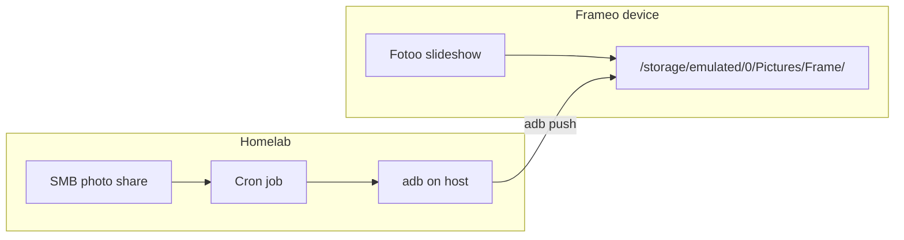

# Frame

Tools and automation for a **Frameo** digital photo frame, repurposed to run **Projectivy** (launcher) and **Fotoo** (slideshow) instead of the stock Frameo app. Photos are synced from a homelab share over the network using **ADB**.

## Overview

| Piece | Role |
|-------|------|
| **Projectivy** | Android TV / kiosk-style launcher; set as the default home screen |
| **Fotoo** | Photo frame slideshow app (`com.bo.fotoo`) |
| **ADB sync** | Push images from a host folder into the frame’s picture directory |



## One-time frame setup

You need a USB or network ADB connection to the frame (`adb devices` should list it).

1. **Install Fotoo** (split APKs from the XAPK bundle):

   ```bash
   task install-fotoo
   ```

   Requires `fotoo_xapk/` with the extracted XAPK contents (not committed; see [Repository layout](#repository-layout)).

2. **Install Projectivy and pick it as Home**:

   ```bash
   task install-projectivy
   ```

   Requires `projectivy.apk` in the repo root (not committed).

3. Confirm packages and device info if needed:

   ```bash
   task list-installed-packages
   task version
   ```

After setup, the frame boots into Projectivy and you launch Fotoo as the slideshow.

## Photo sync

Fotoo reads photos from:

```text
/storage/emulated/0/Pictures/Frame/
```

### Local sync (Task)

With `photos/` populated on your machine and ADB connected:

```bash
task sync
```

This runs `adb push` from `./photos/*` into the frame path above.

### Homelab sync (cron)

On the homelab, a typical job:

1. Mount the SMB folder that holds your shared photos.
2. Point that mount at `./photos` (or equivalent).
3. Ensure the frame is reachable via ADB (`adb connect <frame-ip>:5555` on Android 6 after an initial USB `adb tcpip 5555`, or USB on the host).
4. Run sync from this repo (or the same `adb push` command):

   ```bash
   task sync
   ```

## Task reference

Requires [Task](https://taskfile.dev) (`task` on your PATH).

| Task | Description |
|------|-------------|
| `devices` | List ADB devices |
| `version` | Print Android build / device properties |
| `list-installed-packages` | `pm list packages` on the frame |
| `install-fotoo` | Install Fotoo split APKs from `fotoo_xapk/` |
| `install-projectivy` | Install Projectivy and open the Home picker |
| `sync` | Push `./photos/*` to the frame Pictures folder |
| `restart-frame` | Reboot and launch Fotoo |
| `android-back` | Send Android Back key |

## Repository layout

```text
.
├── Taskfile.yml            # adb helpers
├── fotoo_xapk/             # extracted Fotoo XAPK (gitignored)
├── projectivy.apk          # launcher APK (gitignored)
└── photos/                 # source photos for sync (gitignored)
```

APKs and photo content stay local; the repo holds Task automation only.

## Prerequisites

- Frameo (or compatible) Android device with **developer options** and **USB debugging** (or network ADB) enabled
- **adb** on the host
- **Task** for `task` commands
- Fotoo XAPK and Projectivy APK obtained separately and placed as above
